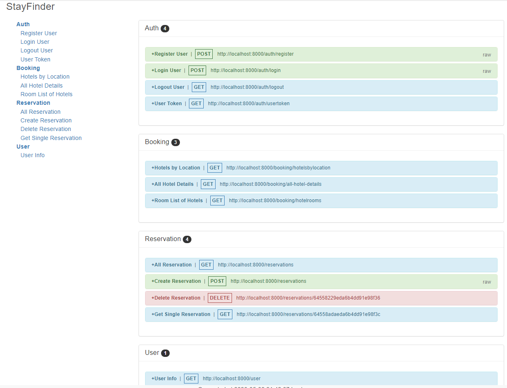

# Back-End Repo for Team 3 of Baboon/Bald Eagle Practicum - StayFinder

## About StayFinder

A hotel search and booking website that provides users with a comprehensive selection of hotels worldwide, complete with detailed information about each property and the ability to create and book reservations

)

## Setup

To set up the server locally, run the following:

```shell
npm i && npm run dev
```

> The back-end server will be running on port 8000. The front-end app will be running on port 3000. You will need to run both the back-end server and the front-end app at the same time to test your app.

## Built With

- JavaScript
- Express
- Mongoose
- jsonwebtoken
- bcryptjs
- [Booking API](https://rapidapi.com/tipsters/api/booking-com)

## Live Demo

A live demo is currently being hosted on render.com:

- [FrontEnd](https://stayfinder.onrender.com/)
- [BackEnd](https://stayfinder-api.onrender.com/)

## Features Include:

- Signup and Signin pages/routes. Token saved in cookie.
- In header you are able to signin or signup if aleady signin then user is able to signoff and navigate to the profile page.
- In User Profile user can see user's info and manage reservations
- You are able to search for a hotel by city or by popular destinations
- See all available hotels in an area
- View the detailed hotel pages with room availability and descriptions based on guest number, checkin date and checkout date
- Streamlined reservation process with check-in and check-out date selection
- Create, View and Delete reservations
- Responsive design for both laptop and mobile devices

## Contributors

- Oksana ([GitHub](https://github.com/OxanaMl))
- Maryna ([GitHub](https://github.com/marinacod))
- Mario ([GitHub](https://github.com/mariolarios))
- Miguel ([GitHub](https://github.com/madebymiguel))

## [API Documentation](endpoint_docs.html)
